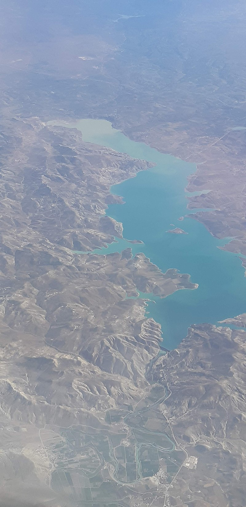

# Monitoring Barrage Massira Using Google Earth Engine & Python

This project utilizes Google Earth Engine (GEE) and Python to monitor the Barrage Massira, one of the largest reservoirs in Morocco. The analysis involves data processing, visualization, and generating insights about the water levels and changes over time.

## Project Overview

### Barrage Massira

Barrage Massira, also known as the Massira Dam, is a large dam located on the Oum Er-Rbia River in Morocco. It is a crucial water reservoir for agricultural irrigation, drinking water supply, and hydroelectric power generation. The dam's construction began in 1979 and it has since become a vital resource for the region.

### Objective

The main objective of this project is to monitor the changes in water levels at Barrage Massira using satellite imagery and remote sensing techniques provided by Google Earth Engine. The project aims to visualize these changes over time and provide meaningful insights.

## Prerequisites

Before running the notebook, ensure you have the following prerequisites:

1. **Google Earth Engine Account**: Sign up for a Google Earth Engine account [here](https://earthengine.google.com/signup/).
2. **Python Libraries**: Install the required Python libraries.

## Project Structure

- **Data Collection**: Utilize Google Earth Engine to collect satellite imagery and relevant data for Barrage Massira.
- **Data Processing**: Process the collected data to extract meaningful information, filter images, and create visual representations.
- **Visualization**: Generate visualizations to understand the changes in water levels over time.
- **GIF Creation**: Create an animated GIF to show the temporal changes in Barrage Massira.
- **Add Text to GIF**: Annotate the GIF with relevant text information, such as year labels.
- **Volume Estimation**: Estimate the volume of the lake using bathymetric data and visualize the lake topography.

## How to Run the Notebook

1. **Authentication and Initialization**: Authenticate and initialize the Google Earth Engine API.
2. **Define Geometry and Image Collection**: Define the geographical region and image collection.
3. **Filter and Visualize Images**: Filter images with zero area and set visualization parameters.
4. **Create and Download GIF**: Define GIF parameters, create the GIF, and download it.
5. **Add Text to GIF**: Create a sequence of text for each year and add it to the GIF.
6. **Volume Estimation**: Estimate the volume of the lake using bathymetric data.
7. **Visualize Lake Topography**: Generate a 3D plot to visualize the lake topography.

## References

1. [Calculating areas in Google Earth Engine](https://developers.google.com/earth-engine/guides/reducers_array)
2. [Module 2: Calculating the surface water mapping](https://developers.google.com/earth-engine/tutorials/community/intro-to-python-api#calculating-surface-water-mapping)
3. Khazaei, Behnaz; Read, Laura K; Casati, Matteo; Sampson, Kevin M; Yates, David N (2022): GLOBathy Bathymetry Rasters. figshare. Dataset. [https://doi.org/10.6084/m9.figshare.13402465.v1](https://doi.org/10.6084/m9.figshare.13402465.v1)
4. [Colorscales in Plotly](https://plotly.com/python/colorscales/)
5. [Constructing custom colorscales on Plotly](https://plotly.com/python/builtin-colorscales/)

---

This README file provides an overview of the project, prerequisites, structure, and references, guiding users through the process of running the notebook and understanding the project's objectives and outcomes.
